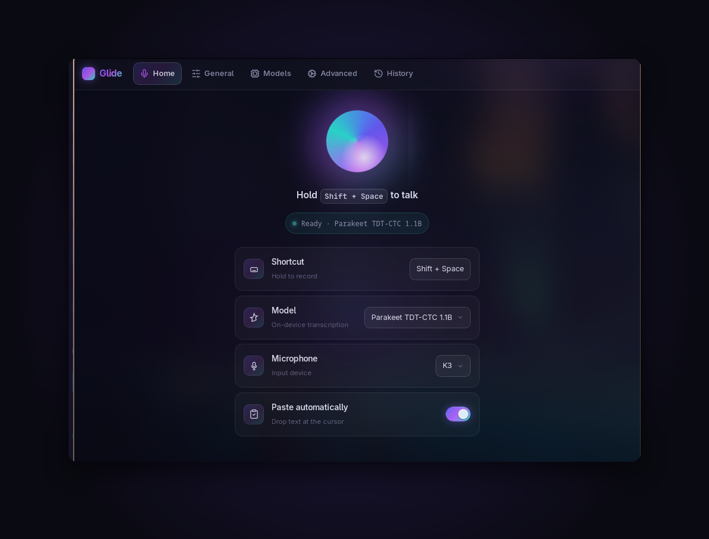

# Glide — Offline Speech-to-Text

Press a shortcut, speak, and your words are typed into whatever app you're using —
**fully on your own computer**, no cloud, no account, no data leaving your machine.

  

### → [**Download the latest version**](../../releases/latest)

Once installed, Glide **updates itself automatically**.

### 📖 New to Glide? Read the [**User Guide**](../../wiki)
How it works · setup · **choosing a model** · every setting explained.

---

## Install

Grab the file for your system from the [latest release](../../releases/latest).
`x64` / `amd64` = Intel/AMD chips · `arm64` / `aarch64` = ARM chips (Apple
Silicon, ARM laptops).

| OS | Download | Notes |
|---|---|---|
| 🐧 **Linux** | `…_amd64.AppImage` (any distro), or `.deb` / `.rpm` | AppImage: `chmod +x` then run |
| 🍎 **macOS** | `.dmg` — `x64` (Intel) or `aarch64` (Apple Silicon) | First launch: right-click → **Open** (not yet notarized) |
| 🪟 **Windows** | `…-setup.exe` or `.msi` — `x64` or `arm64` | SmartScreen → **More info** → **Run anyway** (not yet signed) |

Step-by-step setup, model selection, and all settings are in the
[**User Guide**](../../wiki).

---

## Updates & safety

Glide checks for new versions and updates itself in place — you only download it
once. Every build is **cryptographically signed**, and the app verifies that
signature before installing any update, so updates can't be tampered with or
spoofed.

This repository hosts Glide's release builds and the auto-update manifest
(`latest.json`).
